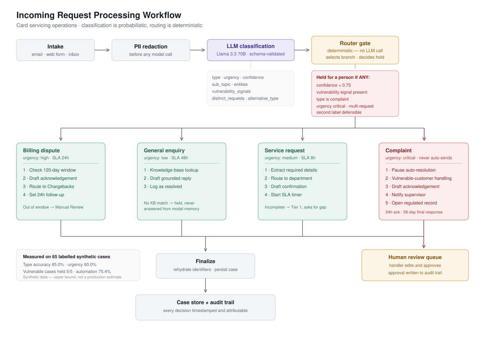

# Incoming Request Processing Workflow

An AI-assisted triage system for a retail bank's card servicing operation. It receives an
inbound customer message, classifies it by type and urgency, routes it deterministically into
a type-specific remediation branch, executes that branch's downstream steps, and records every
decision in an audit trail.

**Context chosen:** consumer credit card servicing (BFSI). The domain was selected because
complaint handling and disputes carry real regulatory constraints, which makes the
human-in-the-loop design decisions concrete rather than hypothetical.

---

## 1. Design principle

**The model reports observations. The code makes decisions.**

A single LLM call produces a validated classification. Nothing downstream asks the model what
to do. Branch selection, hold decisions, department routing and SLA clocks are all pure
functions of that classification.

This was a deliberate trade. An agent-orchestrated design would have been more flexible, but
branch selection here is a known, fixed decomposition — so determinism buys reproducibility,
testability and an audit trail that survives review, at no cost in capability.

The same principle drove a later fix. Asking the model for a calibrated confidence float
produced clustered, unreliable values. Asking it for discrete facts it can actually report —
how many separate requests are in the message, what the second most plausible label would be —
gave the router something dependable to act on.

---

## 2. Workflow



```
intake → PII redaction → LLM classification → router gate → branch → finalize
                                                   ↓
                                            human review queue
```

| Node | Responsibility |
|---|---|
| `intake` | Opens a case, assigns ID and timestamp |
| `redact_pii` | Tokenises card numbers, emails, phones, sort codes **before** any text reaches the model provider |
| `classify` | Single LLM call → Pydantic-validated `Classification` |
| `gate` | Deterministic: selects branch, decides whether output may be sent without a person |
| branch | One of four remediation workflows |
| `finalize` | Rehydrates identifiers for the handler, persists case and audit events |

Built with LangGraph. Branch selection is a conditional edge driven solely by the gate's output.

---

## 3. Classification logic

Four types, each with an operational definition rather than a keyword list:

| Type | Definition |
|---|---|
| `billing_dispute` | Contests a specific charge or transaction believed to be wrong |
| `general_enquiry` | Asks for information; no action needed on the account |
| `service_request` | Asks the bank to perform an administrative action |
| `complaint` | Expresses dissatisfaction with the bank's service, conduct, or prior failure to resolve |

Urgency is judged on **customer impact, not tone** — a message can be angry without being a
complaint. If the core ask is a specific wrong charge, it is a dispute however it is phrased.

The classifier also returns `vulnerability_signals` (bereavement, financial hardship, health
condition, severe distress), `distinct_requests`, and `alternative_type`. These exist purely as
routing inputs; the system never acts on the underlying circumstance itself.

### When a case is held for a person

The gate holds output — no automated send — if **any** of these are true:

1. Classifier confidence below 0.75
2. A vulnerability signal is present
3. The case is a complaint (regulated handling, regardless of confidence)
4. Urgency is critical
5. The message contains more than one distinct request
6. A second classification is genuinely defensible

Rules 2 and 3 are defence in depth: a complaint is held on **request type**, not on the model's
urgency score, so a safety property never depends on a fuzzy judgment. This was a real bug found
by evaluation — complaints were passing through unheld because the model scored them `high`
where the gate expected `critical`.

---

## 4. Remediation strategies

### Billing dispute — urgency high

1. **Check eligibility** against the 120-day chargeback window; unparseable or missing dates flag for manual check
2. **Draft acknowledgement**, mentioning provisional credit only when within window
3. **Route** to Disputes – Chargebacks, or Disputes – Manual Review if out of window
4. **Set follow-up** with a 24-hour investigation update target

### General enquiry — urgency low

1. **Knowledge-base lookup** across 10 FAQ articles, keyword-scored
2. **Draft response grounded in retrieved articles**. No match means no auto-resolution — the case is held rather than answered from the model's own knowledge
3. **Log outcome** as auto-resolved, or route to Tier 1 if ungrounded

### Service request — urgency medium

1. **Extract required details**, checked against what the *receiving department* needs — an address change requires a new address, not a card number
2. **Route to department** (Cards Operations, KYC, Statements, Credit Risk, Payments); incomplete cases go to a generalist queue that can ask for the missing detail
3. **Generate confirmation**, requesting any missing information
4. **Start SLA timer**, 8 hours

### Complaint — urgency critical

1. **Pause auto-resolution.** This branch never sends without a person
2. **Apply vulnerable-customer handling** where signals are present — assigned to a trained handler, standard scripts suppressed
3. **Draft empathetic acknowledgement** that does not admit liability, promise compensation, or give a resolution date
4. **Notify supervisor**
5. **Open complaint record** with a 24-hour acknowledgement target and 56-day final response clock

**Deviation from the brief's example table, and why:** the brief lists Complaint at High and a
separate Escalation/Urgent row at Critical. This build folds escalation into the complaint
branch and reserves Critical for suspected fraud and for cases disclosing vulnerability. In a
real servicing operation the escalation trigger is *who the customer is and what they face*, not
a separate inbound category — a bereaved customer's routine query needs a trained handler more
urgently than a routine complaint does.

---

## 5. Evaluation

Classification was measured rather than asserted. `eval/dataset.jsonl` holds 65 **synthetic**
requests, hand-written against the taxonomy above and labelled independently of the system.
Roughly a fifth are deliberately hard: angry enquiries, disputes buried in politeness,
complaints phrased as service requests, and mixed-intent messages.

```bash
python eval/run_eval.py          # writes eval/report.md
```

| Metric | Result |
|---|---|
| Type accuracy (unambiguous cases) | **85.0%** (51/60) |
| Urgency exact | **80.0%** |
| Vulnerable cases held for a person | **5/5** |
| Ambiguous cases held | 3/5 |
| Automation rate | 75.4% |
| Errors / classifier fallbacks | 0 / 0 |

**Automation rate is a policy outcome, not a performance ceiling.** Three quarters of volume
clears without a person; the remaining quarter is routed to human judgment by design, because
complaints and vulnerability disclosures are held deliberately.

**Vulnerable held is the metric that must not regress.** It is a safety property, not a score —
anything below 5/5 means an automated reply reached someone who needed a trained handler.

**Limitations, stated plainly.** These are 65 synthetic requests measured against a taxonomy
defined alongside the system, so the accuracy figure is an upper bound rather than a production
estimate. Real inbound mail carries typos, forwarded threads and several asks in one message.
Validating against real volume would be the first step of a pilot. The residual type errors
concentrate on the complaint/dispute and enquiry/service-request boundaries, where two trained
handlers would also disagree.

---

## 6. Tools

| Component | Choice | Why |
|---|---|---|
| Orchestration | LangGraph | Typed state, conditional edges, branch subgraphs |
| Model | Llama 3.3 70B | Via Groq or NVIDIA NIM — set `LLM_PROVIDER` |
| Validation | Pydantic | Schema-validated model output, tolerant of predictable near-misses |
| UI | Streamlit | Case card, queue and dashboard for an operations user |
| Store | SQLite | Case records and append-only audit events |
| Retrieval | Keyword-scored JSON | 10 articles does not justify a vector index, and transparent scoring is easier to debug |

**Pro-code was chosen over a no-code orchestrator** because the top-weighted criterion is
classification quality, and a visual builder cannot be measured against a labelled dataset. In a
real deployment where an operations team needs to change routing rules without an engineer, an
orchestrator like n8n would be the right call, with this classification service sitting behind
it as an API.

---

## 7. Worked examples

### Billing dispute

**In:** *"I've been charged twice for the same £84.99 order at Northgate Electronics on 12 July.
My card is 4539 1488 0343 6467."*

**Redaction:** card tokenised to `[CARD_1]` before the model call.
**Classification:** `billing_dispute` / `high` / confidence 0.95.
**Entities:** amount £84.99, merchant Northgate Electronics, transaction date 2026-07-12.
**Gate:** all checks pass → auto-actioned.

**Steps executed:** eligibility confirmed within the 120-day window → acknowledgement drafted
mentioning provisional credit → routed to Disputes – Chargebacks → 24-hour follow-up set.

### General enquiry

**In:** *"How long does a balance transfer usually take, and should I keep paying the old card?"*

**Classification:** `general_enquiry` / `low` / confidence 0.90.
**Gate:** all checks pass → auto-resolved.

**Steps executed:** knowledge base matched "Balance transfer timescales" → response drafted
grounded in that article → case logged as resolved with no human touch.

### Service request

**In:** *"I have moved to 14 Mill Lane, Leeds LS6 2AB. Please update the address on my card
ending 6467."*

**Classification:** `service_request` / `medium` / confidence 0.95.
**Gate:** all checks pass → routed.

**Steps executed:** required details checked against KYC's needs, new address present → routed
to KYC – Account Maintenance → confirmation drafted → 8-hour SLA started.

*Counter-example:* the same request **without** the new address routes to Customer Service –
Tier 1 instead, and the draft asks for the missing detail — an incomplete case is not passed to
a specialist queue that cannot action it.

### Complaint with vulnerability signal

**In:** *"This is the third time I have written. My husband passed away in May and I asked you in
June to move the account into my name. Nobody has actioned anything and I have now had a late
payment letter."*

**Classification:** `complaint` / `critical` / confidence 0.90, `vulnerability_signals:
[bereavement]`.
**Gate:** **held** — two independent reasons fired: the vulnerability signal, and the complaint
type rule. Automated sending disabled.

**Steps executed:** auto-resolution paused → vulnerable-customer handling applied, assigned to
the Vulnerable Customer Team → acknowledgement drafted without admitting liability or
referencing the disclosure in detail → supervisor notified → complaint record opened with
regulatory clocks.

The draft waits in the queue. A handler reviews, edits if needed, and approves — and that
approval is written to the audit trail.

---

## 8. Setup

```bash
python3 -m venv .venv && source .venv/bin/activate
pip install -r requirements.txt
cp .env.example .env          # add your API key
```

`.env`:

```
LLM_PROVIDER=groq             # or nvidia
GROQ_API_KEY=...
CONFIDENCE_THRESHOLD=0.75
DB_PATH=triage.db
```

```bash
python eval/smoke_test.py              # all four branches, no API key needed
python run_one.py --all                # six sample requests through the live pipeline
python eval/run_eval.py                # full evaluation, writes eval/report.md
streamlit run ui/streamlit_app.py      # operations console
```

Credentials are read from the environment. No keys are stored in the repository.

---

## 9. Operations console

**Process** — paste or load a request, see the case card: type, urgency, confidence, why it was
classified that way, the hold banner and its reasons, each remediation step, and an editable
draft.

**Queue** — every case, filterable to those needing a handler. Opening a held case shows the
full detail and an **Approve and send** action, which writes the approval to the audit trail.

**Dashboard** — volume by type, share cleared automatically, cases awaiting review, and handler
workload by queue.

---

## 10. What I would build next

1. **A review agent** between branch and finalize, checking drafts for promises the system was
   never authorised to make — refunds, timescales, invented reference numbers. This came from a
   real defect: a draft once contained a redaction placeholder the model had invented for a
   message with no card number in it.
2. **A secondary dissatisfaction check** that holds any case showing complaint markers even when
   the classifier disagrees. Three complaints in the evaluation were read as disputes or service
   requests and not held — the highest-severity residual risk in the system.
3. **Calibration on ambiguity.** Two mixed-intent cases still pass the gate. The discrete-signal
   approach is the right mechanism; the thresholds need more data.
4. **Validation against real inbound volume,** replacing synthetic evaluation with sampled live
   traffic and handler-confirmed labels. The human review queue is already a labelled-data
   source for exactly this.
5. **Distillation.** At volume, the LLM's outputs become training labels for a small fine-tuned
   classifier — far cheaper per request, with the LLM retained for the ambiguous tail.